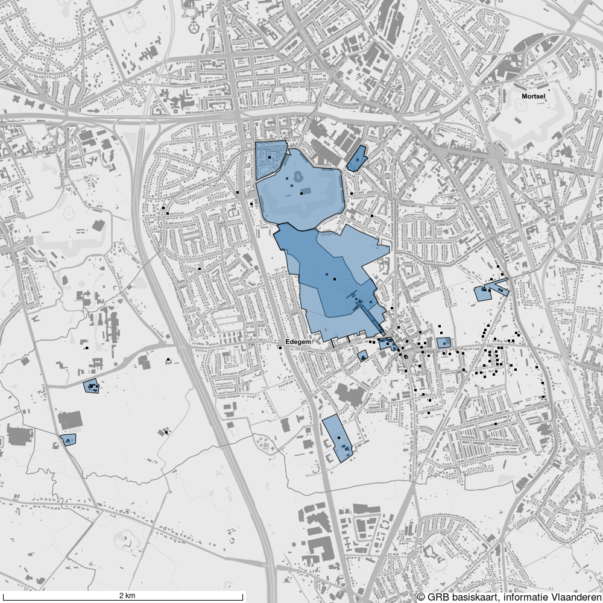

.. post:: 2017-??-??
   :category: services, GIS
   :tags: static_map_generator, geozoekdiensten
   :author: Tinne Cahy
   :language: nl

Erfgoed geprint op een kaart
============================

Het onroerende erfgoed is intuïtief terug te vinden op het Geoportaal (:ref:`waar-ligt-ons-erfgoed`). Via de
service Geozoekdiensten (:ref:`geozoekdiensten`) kunnen we het erfgoed in een bepaald gebied opvragen. En vanaf nu is het
mogelijk om zelf aan te slag te gaan met de informatie, namelijk: Hoe kan ik zelf kaartjes maken van het gevonden erfgoed?

Om de kaartjes te genereren kan gebruik gemaakt worden van de statische kaartgenerator module ontwikkeld bij Onroerend Erfgoed.

Static map generator
--------------------

Het doel van deze `statische kaartgenerator`_ is het genereren van statische kaarten die zijn samengesteld uit:

 - verschillende geografische formaten zoals GeoJSON
 - een achtergrondlaag zoals WMS
 - lay-out-overlays zoals tekst en schaal.

Op basis van een configuratiebestand maakt de kaartgenerator van alle afzonderlijke lagen een afbeelding.
De afbeelding bevat een schaalbalk. De afbeelding kan worden teruggegeven als een foto of een base64 formaat.

De statische kaartgenerator kan zowel als module en service gebruikt worden.

Overzicht locaties erfgoed binnen een gemeente
----------------------------------------------

Het onroerende erfgoed kan via de Open Source modules geplot worden op één kaart. In volgend voorbeeld zal de
gemeente Edegem gebruikt worden. Dit allemaal in een kort scriptje hieronder voorgesteld. Eerst worden alle
erfgoedobjecten en aanduidingsobjecten opgevraagd binnen de gemeente via de geozoekdiensten. Er wordt een basis
configuratie opgesteld om de afbeelding aan te maken: achtergrondlaag, tekst, breedte en hoogte afbeelding.
De geometrie van elk object wordt als een afzondelijke laag toegevoegd aan de configuratie. Ten slotte wordt de
configuratie meegegeven aan de statische kaartgenerator die op zijn beurt de afbeelding zal teruggeven.

.. code-block::python

    # -*- coding: utf-8 -*-
    import os
    import json
    from pyramid.compat import text_
    import requests
    from copy import deepcopy
    from static_map_generator.generator import Generator

    with open(os.path.join(os.path.dirname(__file__), 'Edegem.json'), 'rb') as f:
        edegem_geojson = json.loads(text_(f.read()))

    heritage_objects = requests.post('https://geo.onroerenderfgoed.be/zoekdiensten/afbakeningen',
                                 json={
                                     "categorie": ["erfgoedobjecten", "aanduidingsobjecten"],
                                     "geometrie": edegem_geojson
                                 },
                                 headers={"Content-type": "application/json", "Accept": "application/json"}).json()

    municipality_body = {
        "params": {
            "width": 1000,
            "height": 1000
        },
        "layers": [
            {
                "type": "text",
                "text": "© GRB basiskaart, informatie Vlaanderen",
                "gravity": "south_east",
                "font_size": 4
            },
            {
                "type": "wms",
                "url": "http://geoservices.informatievlaanderen.be/raadpleegdiensten/GRB-basiskaart-grijs/wms?",
                "layers": "GRB_BSK_GRIJS"
            }
        ]
    }

    # Make a map of the municipality to show all the heritage objects

    for obj in heritage_objects:
        municipality_body['layers'].append(
            {
                "type": "geojson",
                "geojson": obj["geometrie"]
            }
        )

    with open(os.path.join(os.path.dirname(__file__), 'maps/Edegem/Edegem.png'), 'wb') as f:
        f.write(Generator.generate_stream(municipality_body))

Inzoomen op de objecten op kaart
--------------------------------

Het is ook mogelijk om voor elk erfgoedobject afzonderlijk een kaartje te genereren. Dit wordt voorgesteld in volgend script.
Bij wijze van voorbeeld, wordt er hier een andere andere achtergrond gebruikt en wordt telkens de naam van het erfgoedobject
bij op de kaart geplaatst.

.. code-block::python

    # Make a map of each heritage object in the municipality
    # As an example only show the first

    body = {
        "params": {
            "width": 1000,
            "height": 1000
        },
        "layers": [
            {
                "type": "text",
                "text": "© GRB basiskaart, informatie Vlaanderen",
                "gravity": "south_east",
                "font_size": 4
            },
            {
                "type": "wms",
                "url": "http://geoservices.informatievlaanderen.be/raadpleegdiensten/omwrgbmrvl/wms?",
                "layers": "Ortho"
            }
        ]
    }

    for obj in heritage_objects:
        if "Polygon" in obj["geometrie"]["type"]:
            obj_body = deepcopy(body)
            obj_body['layers'].append(
                {
                    "type": "geojson",
                    "geojson": obj["geometrie"]
                }
            )
            obj_body['layers'].append(
                {
                    "type": "text",
                    "text": obj["naam"],
                    "gravity": "north_west",
                    "font_size": 6
                }
            )

            filename = obj["naam"].replace(" ", "_").strip() + '.png'
            with open(os.path.join(os.path.dirname(__file__), 'maps/Edegem', filename), 'wb') as f:
                f.write(Generator.generate_stream(obj_body))

Hieronder een aantal resultaten:

.. image:: static_map_images/Fort_5.png

.. image:: static_map_images/Hazeschranshoeven.png

.. image:: static_map_images/Kasteel_Hof_ter_Linden.png

.. _`statische kaartgenerator`: https://github.com/OnroerendErfgoed/static_map_generator