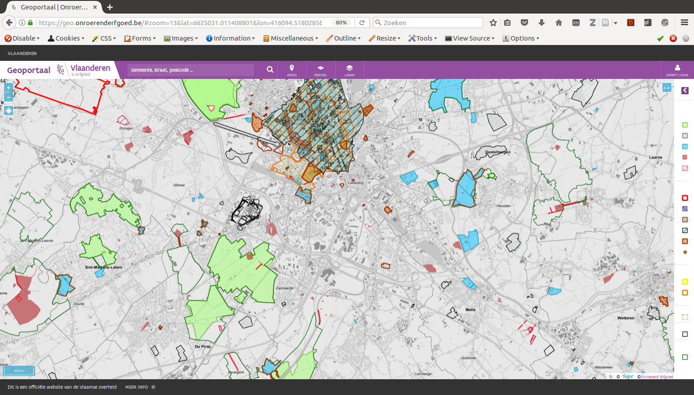

.. post:: 2017-03-14
   :tags: geoportaal, geoserver
   :author: Koen Van Daele
   :language: nl
   :category: GIS

Waar ligt ons Erfgoed?
======================

Eén van de meest karakteristieke eigenschappen van onroerend erfgoed, is
ongetwijfeld het `onroerende` karakter van dat erfgoed. Onze landschappen,
monumenten, archeologische sites, ... hebben allemaal een locatie. Ze bevinden zich
ergens en (uitgezonderd `een paar vreemde eenden <https://besluiten.onroerenderfgoed.be/besluiten?rechtsgevolgen=https%3A%2F%2Fid.erfgoed.net%2Fthesauri%2Fbesluittypes%2F19>`_) 
zijn ze daar altijd al geweest. Als ze niet meer op hun oorspronkelijke plaats liggen,
bestaan ze niet meer. Maar hoe weet je nu wat waar ligt?

Als mens op zoek naar informatie heb je verschillende mogelijkheden. Je kunt 
naar ons `Geoportaal <https://geo.onroerenderfgoed.be>`_ gaan en naar hartelust 
zoomen op de kaart totdat je de plaats die je wil bekijken in het vizier hebt.
Dan kun je met enkele muisklikken zien wat voor erfgoed terug te vinden is op 
die locatie. Indien je liever niet op een kaart kijkt, kun je naar onze `Inventaris
<https://inventaris.onroerenderfgoed.be>`_ surfen en via één van de
zoekformulieren zoeken naar al het erfgoed in een bepaalde straat of gemeente.
Je resultaten zullen minder exact wat je zocht zijn, maar je zult je al snel
kunnen verdiepen in de geschiedenis en de architectuur van de omgeving waarin je
geïnteresseerd bent.

*Alle geografische informatie over onroerend erfgoed kan je vinden op https://geo.onroerenderfgoed.be*

Het is natuurlijk leuk is om snel even iets te bekijken op ons Geoportaal
of een stuk door de inventaris te bladeren, maar misschien is de manier waarop
wij de informatie presenteren niet ideaal voor de vragen die je zelf voor ogen
hebt. Je kunt natuurlijk zelf aan de slag met de gegevens die wij aanbieden. Zo
kun je de verschillende erfgoedinventarissen en de beschermde en vastgestelde
aanduidingsobjecten `downloaden als GIS bestanden
<http://inventaris.onroerenderfgoed.be/portaal/kaarten>`_. Met deze bestanden
kan je zelf aan de slag in je favoriete GIS programma en naar hartelust
analyseren. Elke geometrie is voorzien van een URL naar een webpagina waar je
meer informatie over dat bepaalde erfgoed- of aanduidingsobject kunt vinden.

Dergelijke downloads bieden het voordeel dat je ze kunt gebruiken zonder
netwerkverbinding en dat ze erg snel zijn. Nadelig daarbij is dan weer dat er
elke nacht een nieuwe download wordt aangemaakt en dat je bestanden dus na één
dag al verouderd zijn. Je kunt natuurlijk elke dag de laatste versie downloaden,
maar je kunt ook onze OGC webservices gebruiken. Daarvoor kun je onze `Geoserver
<https://geo.onroerenderfgoed.be/geoserver>`_ raadplegen. Met deze services kun
je onze data in je eigen GIS projecten inladen. In tegenstelling tot de
downloads, zijn deze services altijd de courante versie. Zo kost het je geen
moeite om op de hoogte te blijven van de actuele situatie.

Wie echter voldoende technisch geschoold is en onze data in zijn eigen systemen
wenst te gebruiken kan ook gebruik maken van onze `Geozoekdiensten`. Deze
zoekdiensten bestaan momenteel uit één enkele webservice die uitermate geschikt
is om één enkele vraag te beantwoorden: `Wat ligt er in een bepaald gebied?`. De
gebruier of client stuurt een geometrie naar de webservice en de webservice laat
weten welk erfgoed er deels of geheel in deze geometrie ligt. Dit resultaat is
een simpele `JSON` datastructuur waarin je voor elk object informatie
krijgt zoals een `id`, een `uri`, een `type` en de volledige `geometrie`.
Een volgende keer vertellen we je hoe je gebruik kunt maken
van deze zoekdienst.
