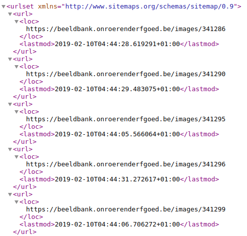
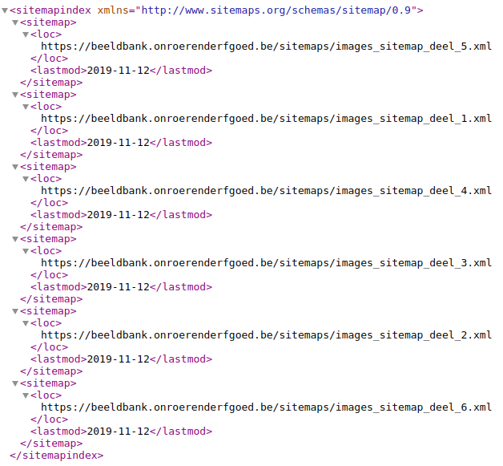

.. post:: 
   :category: architecture
   :tags: search, sitemaps
   :author: Koen Van Daele
   :language: en

A different kind of map
=======================

At `Flanders Heritage <https://www.onroerenderfgoed.be>`_ we love maps! Almost
all the heritage - I'm looking at you, heritage afloat - we're dealing with 
on a daily basis is located somewhere. Quite a lot of our information systems
have some geographical component in them and spatial data is part of our bread 
and butter. But sometimes, we also deal with maps that are not geographical in
nature. Today, we'll take a look at sitemaps. Just like regular maps, these 
have served us wel in helping people discover and find our heritage.

Sitemaps are simple XML documents that can be added to a webserver. These can
then be read by search engines and indexed. Reading a sitemaps tells a search
engine what webpages are present on your server. It's essentially, a huge file
full of links, with a suggestion for your favourite search engine to have a
look at them. Recently we added one for `our image database
<https://beeldbank.onroerenderfgoed.be>`_. This site publishes some 280.000
images of cultural heritage. Most of them taken by or for us. A large majority
of those (some 233.000) can even be reused freely under an open data license.
So, why did we add a sitemap and what have we gotten out of it?

To understand why they might be helpful, we have to understand
how a search engine normally discovers and finds you website and webpages. This
is done by a process known as `crawling`. The search engine acts a
bit like a human surfing the web: it reads a webpage and indexes it (adds the
page to an index if the page has enough relevant content) and then looks at all
outgoing links. It follows these and repeats the process. While the actual
process in deciding if and how a page gets indexed is more complicated, the
mechanism for discovery of pages is quite simple. It means that, as long
as a webpage is linked from at least one other webpage that is known by a
search engine, it will eventually be analysed by the crawler. Off course, this 
is a rather slow process. It depends on some other site linking to your site
and your site having good internal links. Since the web is huge these days, it might 
take a long time for crawlers to discover new pages and sites. Can't we just
guide these crawlers in discovering new stuff?

*A few lines from a sitemap file for https://beeldbank.onroerenderfgoed.be*

So the sitemap comes to the rescue! It's a simple XML file that can
contain all the individual webpages on your website. If you want to be
nice to the crawlers you can add when a page was last updated. This helps the
crawler decide if it should reanalyse a certain page or just ignore it for now.
Since a website can be quite big, it's possible (and for large sites unavoidable) 
to split your sitemap into several files. In that case, one file functions as the 
`sitemap index <https://beeldbank.onroerenderfgoed.be/sitemap_index.xml>`_ and points 
to all the individual files. Everyone of those sitemap files may contain up 
to 50.000 webpages. Together the should give search engines a good idea what
information might be found on your site.

*The sitemap index file for https://beeldbank.onroerenderfgoed.be pointing*

Once you have a sitemap file, you can let the searchengines know where it can
be found. You can either submit these manually to a search engine or advertise
the presence of the sitemap in a `robots.txt` file (a file that contains some
hints for search engine crawlers on how to analyse your site). Once a sitemap
is picked up by a search engine, the engine goes to work on the contents of the file.
Analysing and indexing them. Depending on the search engine and the number of
links it might take a few days or weeks before it's fully up to date with all
the pages on your site.

Off course, that's nice in theory, but does it actually work? Compiling a sitemap
file for a website with thousands of links can (and should) be automated, but it 
still requires some work. And nobody likes doing unnecessary work! Luckily for us, 
`Google` offers us some tools to check how it's indexing your websites. We can 
see how many pages are present in the index, how many pages were considered but not
accepted and which pages produce errors making it impossible for Google to
index them. We can also check how often our site appears in search results and
how often people actually click on those search result and actually reach our
website.

*Coverage for https://beeldbank.onroerenderfgoed.be before and after the
sitemap was introduced (mid oktober)*

If we look at the coverage our site has, we can compare the periode before we
added the sitemap with the period after we added it. This graph clearly
show that adding the sitemap quickly increased our coverage. We have not yet
reached full coverage for the entire site. Currently some 220.000 pages are
indexed. Google chooses how and when it indexes sitemaps, so we can't predict
how long it will take or if it will ever be completed.

*Search performance for https://beeldbank.onroerenderfgoed.be before and after the
sitemap was introduced (mid oktober)*

This next graph shows us how the site has been performing in search results
after we added the sitemap and it was processed by Google. The site went from
appearing between 200 and 400 times a day in search results to appearing 800-1200 times
per day. This has also lead to an increase in clicks to our website. Where we
use to have 5-10 people ckicking through every day, we are seeing between 30
and 40 new clicks. The relative percentage of people who click through hasn't
really changed, but off course the absolute numbers have.

As we have seen, creating a sitemap is a bit of work, but it does increase your
site's visibility in search results tremendously. So, give it a go and add a
sitemap to your site. `Let us know <ict@onroerenderfgoed.be>`_ if and how it
worked for you.
