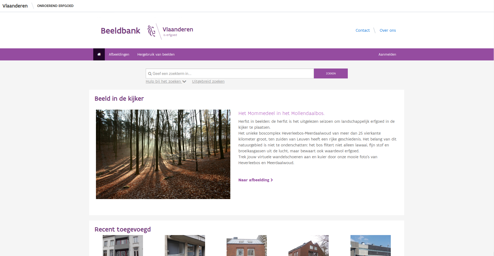
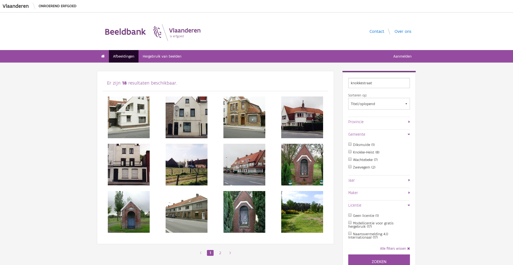
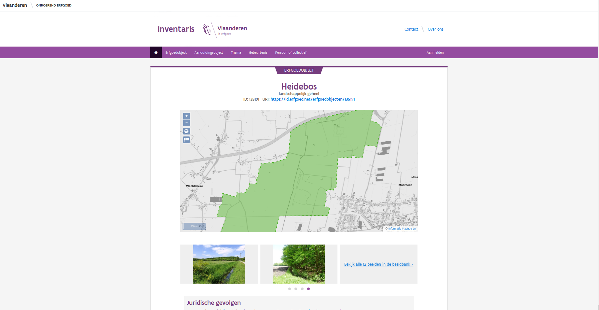
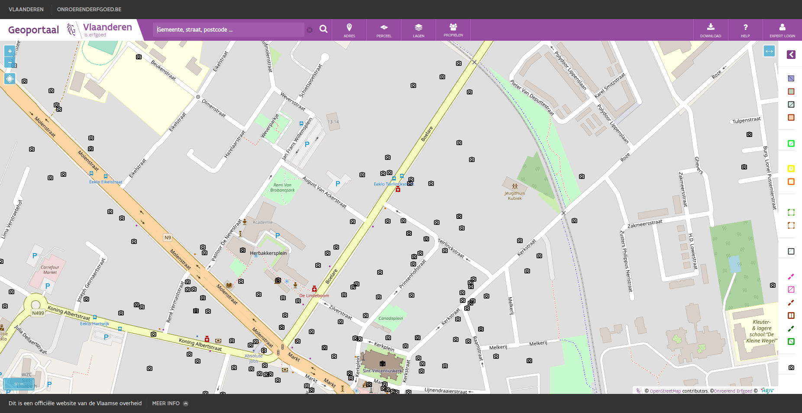

.. post:: 
   :category: services, imagebase
   :tags: beeldbank, search, full-text
   :author: Koen Van Daele
   :language: nl

Zoeken in de beeldbank
======================

We hebben het de laatste tijd al vaak gehad over de nieuwe inventaris
(:ref:`inventaris-nieuw`), maar we hebben in 2019 ook een nieuwe `beeldbank
<https://beeldbank.onroerenderfgoed.be>`_ gelanceerd. Deze vervangt zowel een 
oude module die inherent was aan de inventaris als de beeldbank die ooit voor 
het VIOE ontwikkeld werd. De nieuwe beeldbank bevat ondertussen zo'n 277.000 
afbeeldingen, waarvan een grote meerderheid vrij mag hergebruikt worden zolang 
de `gebruiksvoorwaarden gevolgd worden <https://beeldbank.onroerenderfgoed.be/hergebruik>`_.
Vandaag geven we je wat meer uitleg bij de zoekfuncties van de beeldbank en hoe
je er het meeste uit kan halen.

*De homepagina van de beeldbank*

Als je naar de `homepagina van de beeldbank
<https://beeldbank.onroerenderfgoed.be>`_ surft, dan zie je daar bovenaan een
simpele zoekbalk. Deze helpt je om als een typische zoekmachine op basis van
één of meerdere termen te zoeken. Je tikt er de termen in die je relevant acht
en de toepassing doet zijn werk. Stel dat ik op zoek ben naar afbeeldingen over
de Knokkestraat, dan tik ik `Knokkestraat` in en druk op *zoeken*. We krijgen
18 resultaten, gesorteerd volgens relevantie. Net zoals bij de inventaris
(:ref:`inventaris-zoeken-full-text`) geeft de beeldbank ons de afbeeldingen
gesorteerd volgens de mate waarin ze voldoen aan de zoekvraag. Het meest
`knokkestraat`-achtige object staat vooraan. Dit zijn een aantal afbeeldingen
van huizen in de Knokkestraat te Knokke-Heist, waarbij Knokkestraat zowel in de
titel van de afbeelding als bij het adres staat. Daarna volgen afbeeldingen uit
de Knokkestraat in Diksmuide, Zwevegem en tenslotte Wachtebeke. Bij die laatste
is Knokkestraat wel aanwezig in de titel van het object, maar niet in het
adres.

*Afbeeldingen waarin de zoekterm knokkestraat voorkomt en enkele facetten*

Op deze zoekpagina kunnen we het zoekresultaat ook verfijnen. Daarvoor
gebruiken we zogenaamde facetten. Dit zijn filters die we kunnen instellen op
de bestaande dataset. In dit geval kunnen we expliciet filteren op `Provincie`,
`Gemeente`, `Jaar`, `Maker` en `Licentie`. Bij elk facet zie je alle mogelijke
waarden, inclusief hoe vaak ze voorkomen. Zo zien we dat er 8 afbeeldingen uit
Knokke-Heist zijn en maar 1 uit Diksmuide. Het laatste facet, licentie, geeft
aan onder welke voorwaarden een afbeelding hergebruikt kan worden. Zo zien we
dat 17 afbeeldingen vrij voor hergebruik zijn onder één van twee licenties en
dat 1 afbeelding niet vrijgegeven is voor hergebruik.

De facetten spreken redelijk voor zich, het tekstveld vrij zoeken kan nog
wel wat uiteg gebruiken. Net zoals bij de inventaris kan je hier full-text
zoekoperatoren op toepassen:

* Als je meerdere zoektermen opgeeft, dan combineer je die impliciet als EN.
  Dus, als je zoekt naar `molen knokke <https://beeldbank.onroerenderfgoed.be/images?text=molen+knokke>`_,
  dan vraag je naar alle afbeeldingen waarin zowel de term `molen` als de term 
  `knokke` voorkomt. Je kunt dit ook expliciet maken met de `&` (EN) operator. 
  Dus, `molen knokke` en `molen & knokke` zijn exact hetzelfde.
* Als je wil zoeken naar afbeeldingen waarin ofwel `molen` ofwel `knokke`
  voorkomen, dan gebruik je de `|` (OF) operator. Dus, `molen | knokke <https://beeldbank.onroerenderfgoed.be/images?text=molen+%7C+knokke>`_.
  Dat zijn er natuurlijk heel wat meer.
* Stel dat je een bepaalde zoekterm niet wenst te vinden, dan gebruik je de `-`
  (NIET) operator. Deze plaats je vlak voor de zoekterm die je niet wenst te zien.
  Dus, `molen -knokke <https://beeldbank.onroerenderfgoed.be/images?text=molen+-knokke>`_ 
  om alle molens waar Knokke niet in voorkomt te zoeken.
* Indien je meerdere zoektermen als één zoektermen wenst te beschouwen, plaats
  je die tussen aanhalingstekens. Stel dat ik zoek naar `van daele
  <https://beeldbank.onroerenderfgoed.be/images?text=van+daele>`_, dan krijg
  ik 7 afbeeldingen waarin zowel het woord `van` als het woord `daele`
  voorkomt. Stel dat ik echter afbeeldingen zoek van een fotograaf `van daele`,
  dan kan ik zoeken naar `"van daele"
  <https://beeldbank.onroerenderfgoed.be/images?text=%22van+daele%22>`_ om alles 
  van deze fotograaf te zien.
* Indien ik slechts op een deel van een woord wil zoeken, dan kan ik de
  wildcard `*` gebruiken. Let op, dit werkt enkel op het einde van een woord.
  Als ik bv. zoek naar `roze*
  <https://beeldbank.onroerenderfgoed.be/images?text=roze*>`_, dan krijg ik 
  afbeeldingen waarin zowel `rozendale`, `rozeveldstraat` als `rozebeekstraat` 
  of gewoon `roze` voorkomen. Zoals gezegd, werkt dit niet voor `*roze` of `r*ze`.
  Zo'n zoekopdracht zou namelijk onze systemen en dus ook jullie geduld veel 
  te veel belasten.
* Tenslotte kan je haakjes `()` gebruiken om zoekoperatoren te groeperen. Zo kan
  je met `dorp* (knokke-heist | brugge)
  <https://beeldbank.onroerenderfgoed.be/images?text=dorp*+%28knokke-heist%7Cbrugge%29>`_ 
  zoeken naar afbeeldingen waarin termen voorkomen die beginnen met `dorp` en
  waarin ofwel `knokke-heist` ofwel `brugge` voorkomen.

Denk er aan, als je met het algemene zoekveld zoekt, zoek je bepaalde woorden.
Dat kan overeenkomen met iets als "een gemeente" of "een plaats", maar kan
evengoed iets anders opleveren. Als je bijvoorbeeld zoekt naar `brugge*`, 
kan je zowel afbeeldingen vinden die iets te maken hebben met `bruggen`, 
als afbeeldingen uit de gemeente `brugge`. Onze zoekmachine probeert standaard
de afbeelding zo te rangschikken dat de afbeelding die het meest aan je vraag
beantwoord, bovenaan staat. Bepalen welke afbeelding het beste antwoord is op
je vraag is niet eenvoudig. In grote lijnen komt het er op neer dat een
afbeelding waarin een zoekterm meerdere keren voorkomt als relevanter wordt
gezien dan een afbeelding waarin de term maar 1 keer voorkomt. Daarnaast wordt
een zoekterm in bepaalde velden als relevanter gezien dan in andere. Zo zal
eenzelfde zoekterm meer wegen in het titelveld dan in een stukje van de
locatie, wat op zijn beurt meer weer weegt dan de zoekterm in de beschrijving
van de afbeelding.

Je kunt zoekopdrachten met de full-text parameter perfect combineren met facetten. 
Dus als je zoekt naar `brugge*` en daarna kruis je het jaar `2019` aan, dan zie je
alle afbeeldingen uit 2019 waarin een woord voorkomt dat begint met `brugge`.

*Een erfgoedobject in de inventaris onroerend erfgoed met links naar de beeldbank*

Naast het zoekformulier zijn er nog andere mogelijkheden om een afbeelding
terug te vinden. De overgrote meerderheid van onze afbeeldingen zijn gekoppeld
aan de `inventaris onroerend erfgoed <https://inventaris.onroerenderfgoed.be>`_.
Als je daarin een erfgoedobject opzoekt, dan zie je daar een aantal
afbeeldingen. Dat zijn allemaal afbeeldingen uit de beeldbank. We tonen er
altijd een aantal, en bieden je ook een link om alle afbeeldingen tegelijk te
zien. Ofwel klik je op één enkele afbeelding om rechtstreeks naar die
afbeelding te gaan. Ofwel klik je op de link naar alle afbeeldingen en kies je
daar de individuele afbeeldingen die je interesseren.

*De afbeeldingen uit de beeldbank bekijken op het geoportaal*

Wie dat wil kan ook gebruik maken van ons `geoportaal
<https://geo.onroerenderfgoed.be>`_. Daar bestaat een optionele laag `Beeldbank`.
Deze staat standaard uit, maar kan je aanvinken in het menu onder `Lagen`. Eens
je deze aanzet, zie je overal op kaart camera icoontjes verschijnen, maar enkel
als je ver genoeg ingezoomed bent op de kaart. Klik op een icoontje om alle
afbeeldingen op die locatie te zien. Daarna kan je naar hartelust doorklikken
naar de beeldbank om de afbeeldingen te downloaden. Wie regelmatig met GIS
werkt kan deze laag ook `downloaden <https://geo.onroerenderfgoed.be/downloads>`_ 
en integreren in zijn eigen dagelijkse werking. In de attributen-tabel is
steeds de URL opgenomen waar je alle formaten van de afbeelding kunt
downloaden.

Zoals je ziet zijn er dus meerdere manieren om afbeeldingen terug te vinden in
onze beeldbank. We hopen dat jullie hier dan ook naar hartelust gebruik van
maken. Denk er alleen steeds aan dat je de licentievoorwaarden respecteert en
iedereen correct erkent voor het geleverde werk. Mocht je nog vragen of suggesties 
over de beeldbank hebben, `stel ze dan gerust <ict@onroerenderfgoed.be>`_

