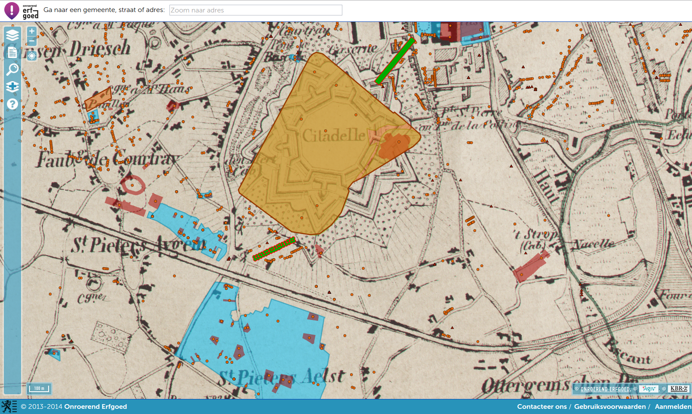
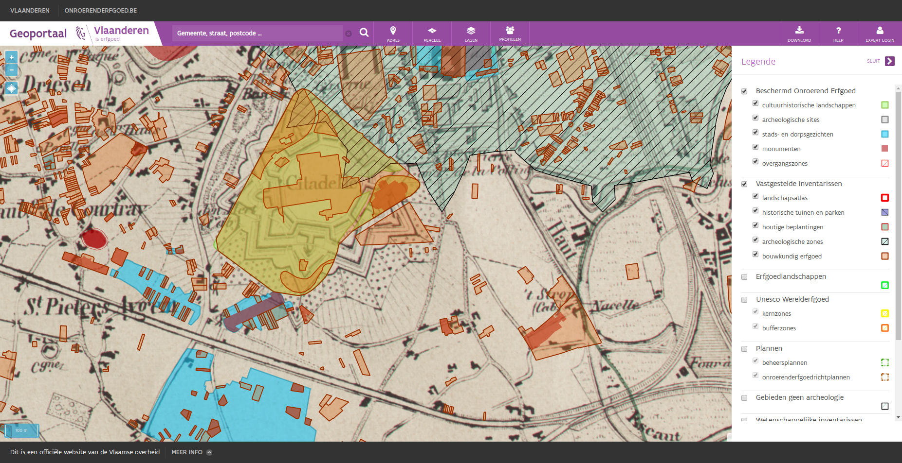
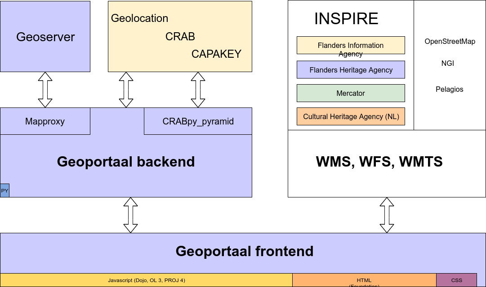

.. post:: 2019-11-28
   :category: services, gis, architecture
   :tags: geoportaal, geoserver
   :author: Koen Van Daele
   :language: en

Flanders Heritage Geoportal: All Together Now!
==============================================

*The Flanders Heritage geoportal in 2014*

`Flanders Heritage <https://www.onroerenderfgoed.be>`_ has had a `geoportal
<https://geo.onroerenderfgoed.be>`_ since 2013. Although it has grown and
transformed over the years, the basic goals and the architectural design have
remained largely unchanged. Our first and main requirement was that we wanted
something that was easy to use for a large userbase. We had observed that other
geoportals tended to cater to GIS professionals and quite often sought to
build an online version of a desktop GIS. This creates a web application that
might be versatile and quite powerful to people who know GIS, but is ultimately
inaccessible to users who have no GIS experience. Our goal was to create a user
experience similar to `Google Maps` and other webbased mapping platforms, but
specifically tailored to users looking for information on cultural heritage in
Flanders. We also wanted the geoportal to feel like an integral part of 
our online information systems, not just a separate geodata portal. To achieve 
this we created reports that link to our online sources through their persistent 
URI's. These URI's are present as metadata in all our geographical data and link 
features back to their authentic source, the application the raw data 
(including geodata) lives in. You can always follow these links to get the
exapnded set of attributes present there and discover everything we know about a
certain resource.

*The Flanders Heritage geoportal in 2019*

A second requirement came about through the data we wanted to show. While
Flanders Heritage creates, maintains and publishes geodata about immovable 
cultural heritage, it does not publish other geodata. We did not want to start
doing this just for the geoportal, so we wanted to use as much publically 
accessible webservices as possible. We have always relied
heavily on `Flanders Information Agency <https://informatie.vlaanderen.be>`_
(the former Agentschap Geografische Informatie Vlaanderen or AGIV) as our partner for
supplying us with geographical basemaps and non-heritage related information
layers. We also had other layers we wanted to incorporate, from other entities
of the Flemish Government such as `Mercator <https://mercator.vlaanderen.be/>`_ 
or other countries (`RCE <https://www.cultureelerfgoed.nl/>`_). We not only 
rely upon `Flanders Information Agency` for geographical layers,
they also provide alfanumerical services that help in navigating maps.
There's the `CRAB service <https://overheid.vlaanderen.be/informatie-vlaanderen/producten-diensten/centraal-referentieadressenbestand-crab>`_
that enumerates all address data in Flanders 
, the `CAPAKEY service <https://overheid.vlaanderen.be/capakey-rest-service>`_ 
that provides data on cadastral parcels and a `geolocation service <https://loc.geopunt.be/Help>`_
that helps to quickly find a certain address in a free-form text-search
style. We wanted to use all these services, but not just copy their data, as
would have happened ten years earlier. We wanted to store as little data as
possible from these services. A few caches here and there are fine, but not
full-scale copies of other services and databases. This way the information we
show to our users is always as up to date as the source of origin.

Finally, from a technical point of view we wanted to work with open source
software (because this is cost efficient and because it fits ours
technical stack nicely). We also wanted the maintenance of the portal to be 
fairly simply, while still allowing us to configure things in an optimal way.
As is often the case, we wanted to make the easy things (adding a new datasource) 
simple to do and the hard things (optimising certain requests) doable.
This philosopy has worked out well for us. With a very light codebase we have
been serving our visitors for years now.

*Software architecture of the Flanders Heritage Geoportal*

So, if those were the main design considerations, where did we end up? As all 
modern applications, the geoportal consists of a back- and a frontend. The frontend is the most
sizeable piece of code (about 98% of all code is Javascript, HTML and CSS) and 
consists of the map layout, UI/UX and general presentation layout. Since the
code was written several years ago, it still uses a rather old Javascript 
framework, `Dojo <https://dojotoolkit.org>`_. The mapping interface uses
`Openlayers <https://openlayers.org>`_ (and `PROJ 4 <http://proj4js.org/>`_). 
The HTML and CSS comes from our implementation of the Flemish corporate style
for websites using the `Zurb Foundation framework <https://foundation.zurb.com/>`_`.
The geoportal frontend communicates entirely through services with either our
own geoportal backend or other webservices.

Those other webservices are for the largest part INSPIRE compliant WMS, WMTS
and WFS services hosted by one of several parties:

* `Flanders Information Agency <https://informatie.vlaanderen.be>`_ hosts 
  a large number of reference datasets such as basemaps, aerial photography,
  historic maps, address data, cadastrals parcels, ... in the offical 
  `Flemish INSPIRE node <https://www.geopunt.be>`_.
* `Mercator <https://mercator.vlaanderen.be/>`_ is an INSPIRE subnode that
  hosts datasets and maps dealing with data from the policydomain Environment
  (`Beleidsdomein Omgeving`). This is a clust of Flemish Government entities
  that deal with theme such as Environment, Pollution, Energy, Heritage,
  Spatial Planning, ... Flanders Heritage publishes its own INSPIRE compliant
  heritage data through this subnode.
* While our end users use `Mercator` to harvest our datalayers, specifically 
  for our geoportal we host our own `Geoserver <http://geoserver.org/>`_ 
  instance. This allows us a bit more control over certain presentation related 
  issues. We also have a few layers that are reserved for internal 
  or authenticated use, so as we can't just publish them.
* We have also included the Dutch INSPIRE layers about cultural heritage from
  our colleagues at `Cultural Heritage Agency
  <https://english.cultureelerfgoed.nl/>`_. Heritage doesn't adhere to
  current day political boundaries, so it can be interesting for our users to
  have a look across the border. Having other published WMS services makes
  this easy to incorporate.

We also use a few layers that are not a part of INSPIRE. We use
`OpenStreetMap <https://www.openstreetmap.org/>`_ as a good baselayer for 
general use and the NGI Topographical map for those who are interested. And 
more or less for fun we added the `Pelagios map of the Roman World
<https://dare.ht.lu.se/>`_.

The geoportal backend is a simple Python application, written using the `Pyramid
framework <https://trypyramid.com/>`_. Apart from serving the static files 
for the frontend, it has two major functions. It's main job is to proxy certain 
location services by `Flanders Information Agency`:

* `Geolocation <https://loc.geopunt.be/Help>`_, a service that suggests 
  adressess based on simple text imput and returns geographical coordinates.
  It's a quick and easy way to navigate our map of Flanders.
* `CRAB <https://overheid.vlaanderen.be/informatie-vlaanderen/producten-diensten/centraal-referentieadressenbestand-crab>`_, 
  a more exhaustive service that has full-address data in the form of
  lists of municipalities, streets, housenumbers and their location. We use
  this service in most of our systems to validate incoming data, but in the
  geoportal it's used as a navigational aid. Users can descend from provinces
  over municipalities and streets to addresses, without ever getting lost
  along the way.
* `CAPAKEY <https://overheid.vlaanderen.be/capakey-rest-service>`_, a REST service
  that has parcel data in the form of lists of municipalities, cadastral divisions, 
  sections and parcel numbers. Similar to the CRAB service, we use this service to 
  guide our users through the Belgian cadastral system to the parcel they are 
  interested in.

Nowadays, these three services are freely and openly available, so the need to
proxy them might be less obvious now than when we started in 2013:

* In the beginning both CRAB and CAPAKEY were SOAP services, difficult, if not
  impossible, to work with from within a browser using JS. Not that long ago, 
  CAPAKEY switched to a REST Service, so technically we could access it directly.
  But we'd still be left with the CRAB SOAP service. When we started out, both
  the CRAB and CAPAKEY services required authentication as well, so we had to
  proxy the service to shield credentials.
* It frees us from fiddling with CORS headers. We already use CORS quite
  often, but getting everything to function together can be a hassle. The
  Geolocation service does not support CORS anyway, so we would have to work 
  with something like JSON-P there.
* It protects us from upstream API changes. Since our own applications always 
  use our proxies, we only need to ensure the proxies knows how to talk to the
  upstream API. If these change (eg. the move from SOAP to REST for CAPAKEY),
  the impact on our systems is minimal and clear.
* The proxies for CRAB and CAPAKEY also function as caches. They reduce the
  number of calls we have to make to the upstream services tremendously.
* We enhanced the AIV services in a few ways, to fit some of our own particular
  needs. We added a list of Flemish provinces, not present in either CRAB 
  or CAPAKEY. We also incorporated a `list of all country codes 
  <https://pypi.org/project/pycountry/>`_, to be used in address validations.

If you yourself have a need for Flemish address or parcel data, and you're
using Python, feel free to use our `CRABpy <https://pypi.org/project/crabpy/>`_ 
library. If you're using the `Pyramid` framework, you can also use 
`CRABpy_pyramid <https://pypi.org/project/crabpy_pyramid/>`_ that simplifies 
integrating the library in a Pyramid environment and also offers a set of
opinionated JSON views on the upstream services.

The other main component of our Python backend is an open source project called
`Mapproxy <https://mapproxy.org/>`_. This wonderful library helped us solve what, 
for a while, was the most challenging aspect of building the geoportal: dealing 
with non-publicly accessible spatial data. Our prime example is a database of 
archaeological findspots. For several reasons, this database and the accompanying 
GIS data, is not available to the general public. The data is not part of INSPIRE,
but does have WMS/WFS services in our own `Geoserver` instance. This service can be
protected by using username/password. Off course, if we would just include this
service in our frontend code, we would be exposing the username and password to
clients. Luckily, Mapproxy makes this easy to solve. The services are proxied
on our geoportal server, but with Mapproxy intercepting all calls and doing
authentication and authorisation on the supplied credentials. This way, we can
transform the typical `Pyramid` authentication/authorisation policies we use in
all our webapplications to statements about the configured GIS layers.

Apart from this essential security related proxying, we also proxy
WMS GetFeatureInfo requests through Mapproxy, again to avoid potential CORS issues.
In the near future we might also be using it's caching features, although we
haven't done so this far.

All in all, our `geoportal <https://geo.onroerenderfgoed.be>`_ has proven to 
be an important online platform for us. It has been in use for years now and 
is used by some 12.000 people every month, in fairly intensive sessions. The cost of
building and maintaining it however, has been fairly low. The portal itself
requires very little resources to run on and has a very low
footprint when running. Most of the heavy lifting is done by the underlying
services that are also used for other applications and other processes. 
Interested in our setup?  Browse the geoportal, have a look at our software
libraries at `Github <https://github.com/onroerenderfgoed>`_, read some more 
:ref:`category-GIS` related blog posts or drop us a line at ict@onroerenderfgoed.be
