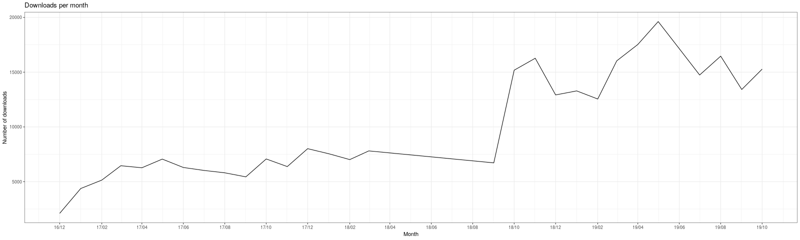
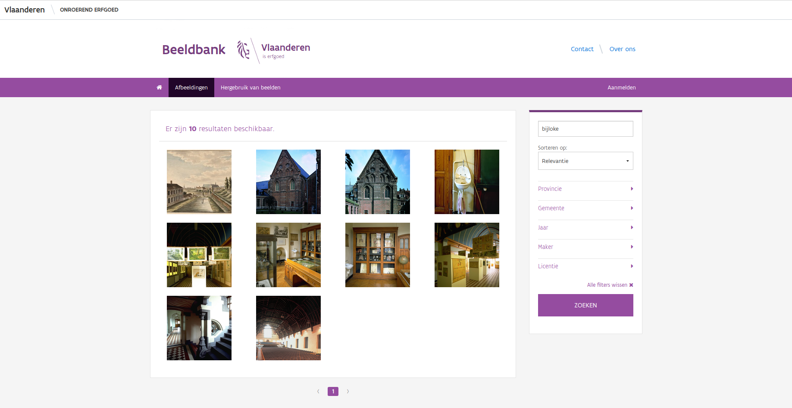
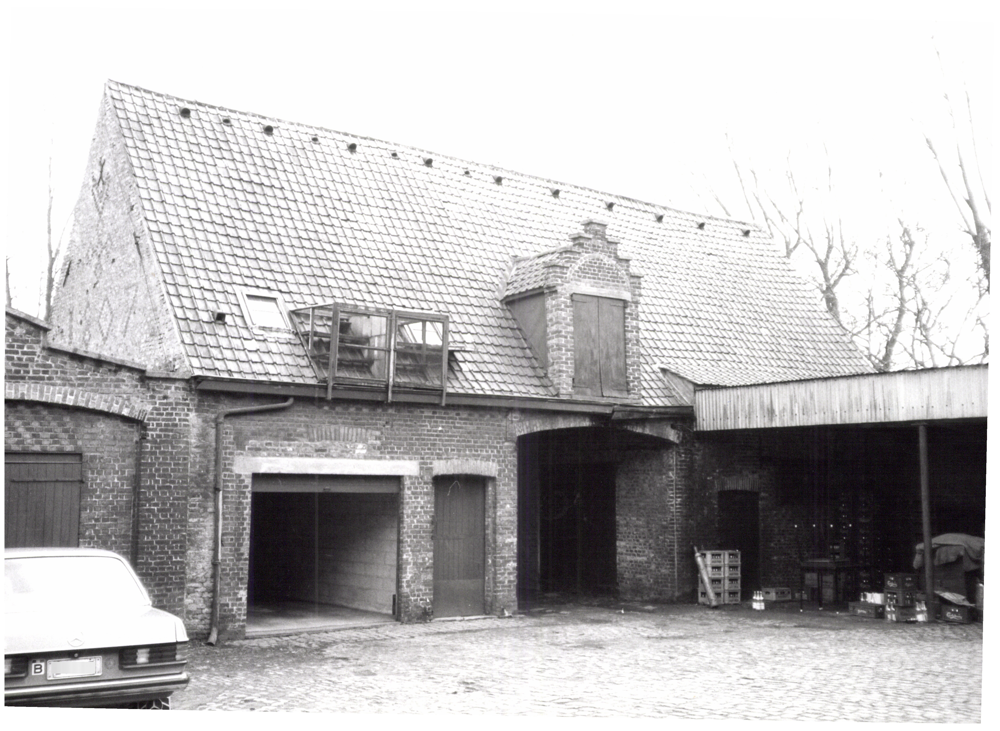
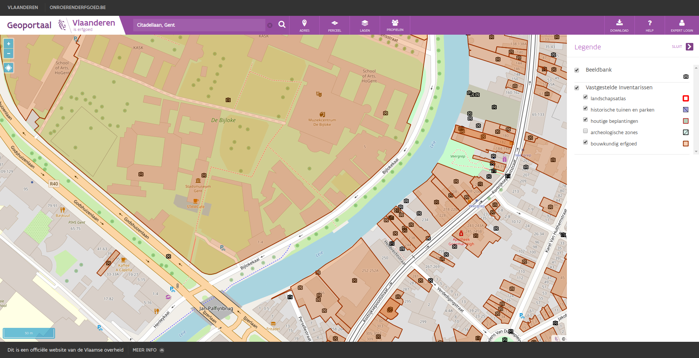
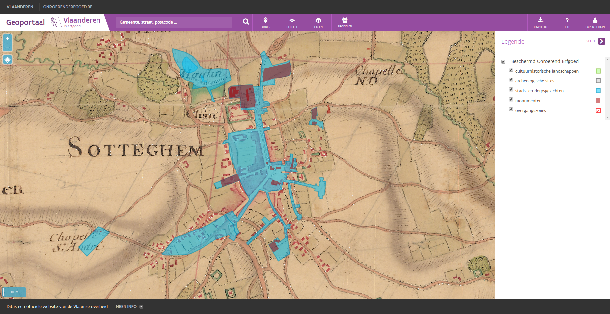
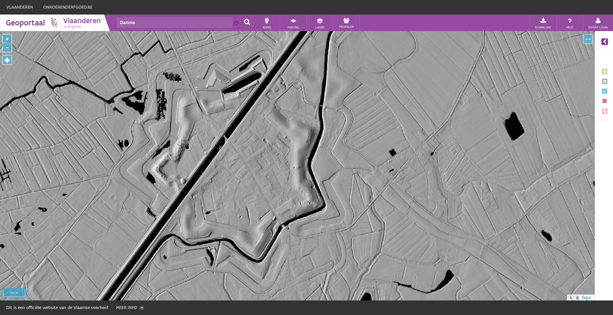
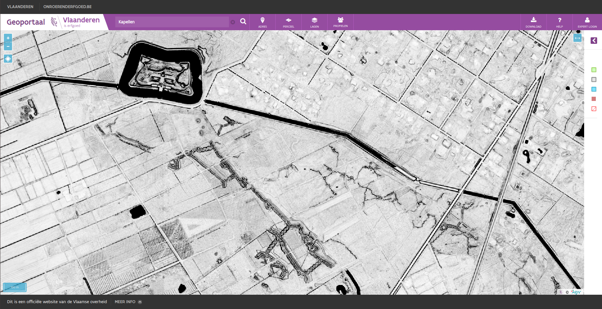

.. post:: 2019-11-20
   :category: GIS
   :tags: innovation, geoportaal, beeldbank, OAR
   :author: Koen Van Daele
   :language: en

Welcome to the Ilucidare Playground
===================================

`Flanders Heritage Agency <https://www.onroerenderfgoed.be>`_ is a government
agency and scientific institution. We are responsible for architectural,
archaeological, landscape and maritime heritage. Today we are 
present at the `Ilucidare Playground: Cracking the
future of heritage <https://ilucidare.eu>`_. We assimilate innovation to
improve the preservation of heritage, to enhance decision-making, to support
the management or to provide information to a broad public. To this end, we are
mixing new technologies or new paradigms with our care and responsabilities 
for heritage. Today we focus on a few tangible results of this
innovation driven approach that demonstrate how well heritage, technology and
digitisation match.

No innovation without dissemination
-----------------------------------

While innovation often comes to mind when we are talking about technology, our
society is innovating constantly as well. Sometimes it drives the technological
advances, sometimes it follows them. One of the innovative approach of the past
decade has been the shift towards openness. Open source software, open data and
open access are key in today's information driven society. Both Flanders Heritage 
and the Flemish Government
are in favour of open data and open access. For open data, the government has
adopted the `Smart Flanders Open Data Charter <https://smart.flanders.be>`_. At
Flanders Heritage, we have published several open data sets, such as our
`thesauri and controlled vocabularies <https://thesaurus.onroerenderfgoed.be>`_, 
under the Flemish open data license. Not only do we publish those thesauri as
open data, we also publish the `software to maintain them <https://github.com/onroerendErfgoed>`_ as 
`open source software <https://github.com/onroerendErfgoed>`_.

When it comes to scholarly open access
we strive to make all our publications publically available, free of charge. Nearly all 
research output gets published at `OAR, our Open Access Repository <https://oar.onroerenderfgoed.be>`_.
The past years we have invested in digitising publications by our
predecessors. We now have an online publication archive going back to the
eighties. All these publications can be freely downloaded and accessed. While 
digitisation might seem like a a trivial matter (scan it and put it online), 
it has taken quite a lot of time and effort due to factors such as copyright
and the effort it takes to create good metadata. But the end result has been
worth the effort. We have found
that in today's digital world, knowledge and information are at risk of
becoming obsolete if not available in the way people expect them to be. By
digitising older information sources, we give them that little push, that
little bit of innovation, to make them relevant in today's roaring digital
twenties. Our download statistics prove that this has very much been
appreciated. Ever since we digitised and published our back catalogue, the number of
downloads per month has doubled. We now have about 15.000 publications that are
digitally consulted every month.

*Number of downloads per month from OAR*

Pictures or it didn't happen
----------------------------

While our publications are still very much an information channel that spreads
written information, today an increased importance is placed on visual
information. Where 20-30 years ago digital mostly meant textual information
(anybody remember ASCII art?), today a lot of emphasis is placed on digital
media: audio, video and images (mostly of cats it seems). While audio and video is
still a fairly rare format for us, images have always been a staple in our
information diet. Heritage professionals have been documenting heritage and
its current state ever since cameras became available. The rise to prominence
of digital cameras and more recently smartphones with a good camera has only
accelerated this process. We estimate that within our agency a few million
pictures are circulating in both analog and digital formats. In 2019 we
launched a new online `image database <https://beeldbank.onroerenderfgoed.be>`_
containing some 280.000 images of heritage in Flanders. Some of them recent,
some of them digitised from analog sources in our archives. Again, a lot of
importance was placed on reuseability. Where possible, they are published under
an open data license allowing reuse, even for commercial purposes, as long as
attribution is guaranteed.

*A set of images in the image database found by searching for `Bijloke`*

Our system has been running for a while now and has proven that our basic needs 
have been covered. We are now looking into a few more complex
problems. For starters, there are issues dealing with GDPR and privacy.
While our pictures are taken in publically accessible locations, certain 
information visible is considered sensitive data. This is mainly the case when 
license plate numbers or people's faces are visible. While we do have manual
procedures in place to check for these things, they are time consuming and require 
a lot of manual energy. We are now looking into automatic recognition and, if possible,
automatic blurring of license plate numbers and faces using the 
`OpenCV <https://opencv.org/>`_ library. So far we have had very
good results with the license plates, but more mixed results with the
faces. We attribute this to the license plate formats being rather simple and
predictable. With facial recognition, we are facing issues that might
be more typical of our line of work. The automated detection of faces is a
bit too eager and has a tendency to detect works of art like paintings,
sculptures or billboard as human faces as well. Further work will be needed to
finetune this enough to make it fit for large-scale use.

*The license plate on the left was automatically blurred with OpenCV*

Another avenue we are pursuing is automated detection of duplicate pictures. As
is often the case in large organisations, files are distributed, copied and
mailed over and over again. Images are no exception to this rule. An image ends up being
present in different locations. All these duplicates cost storage space, which
can be quite expensive. Since every image requires metadata, this also leads to
duplication of metadata and the effort of creating it. We are now looking
into ways of automatically detecting duplicate images. So far, the technique of
`image hashing <https://www.pyimagesearch.com/2017/11/27/image-hashing-opencv-python/>`_ 
has proven to be very interesting and we will probably settle on the `dHash` algorithm.
Currently we are investigating how to properly integrate this in our image
archiving workflows so our colleagues gain all the benefits of this technique
without being confronted with the technical details. One could argue
that innovation only becomes productive when it goes hand in hand with
useability.

As a government agency dealing with immovable cultural heritage, almost all
data we collect have some spatial component. Our images are no different.
Almost every picture we take, is a picture of some kind of immovable cultural
heritage, be it an archaeological sites, a cultural landscape, a building, a
cemetary or another form of heritage. So we made a substantial effort to geolocate
the images in our image database. For older images, we linked them
to the `heritage objects <https://inventaris.onroerenderfgoed.be/erfgoedobjecten_info>`_ 
they depict and copied their location. For newer images, we are relying on the
automatic geolocation present in modern day smartphones and digital cameras.
The resulting GIS layer consists of point locations of most of our images and
can easily be visualised on our `geoportal <https://geo.onroerenderfgoed.be>`_ 
or `downloaded <https://geo.onroerenderfgoed.be/downloads>`_ for your own use.
For every picture you can then click through to the image database to find out more 
about it, download it and reuse it - provided you adhere to the license.

*A view of the Bijloke site in Ghent with all known images of this area.*

Give me a map and I'll never get lost
-------------------------------------

As we have stated, almost everything we do has a spatial component. For us,
maps are essential. Today, that means :ref:`category-GIS` is essential to us.
As a government agency we publish INSPIRE compliant datasets that get
distributed through the `INSPIRE network across Europe <https://inspire.ec.europa.eu/>`_.
This is mostly aimed at the professional GIS user, using his or her own desktop software. But we
felt that we were lacking a certain part of our target audience. People wanting
to quickly find out what information we had for their neighbourhoods or 
properties or just that place they knew as a child or passed yesterday. To this end, 
we created our own `Geoportal <https://geo.onroerenderfgoed.be>`_, a simple 
website where a user can consult a (hopefully) intuitive map of Flanders and 
see what kind of heritage is present. We purposefullly built this portal for regular, non-GIS users. We
wanted to make it feel like `Google Maps for Heritage`. While it's no longer a new
tool, it's still very popular among our users. Because we focus on presenting our 
own data as best as possible, the interface is optimised for people looking for 
spatial data on heritage, as opposed to just any spatial data. Those people we 
gladly refer to `Geopunt <https://geopunt.be>`_, a geoportal for all spatial data
produced by the Flemish Government. It contains far more data than we need, but its 
use is not optimised for heritage information and it might take longer to find
exactly that piece of information you're looking for.

*The current day city of Zottegem and its listed heritage as seen on the Villaret map (1745-1748)*

If you visit the `Geoportal <https://geo.onroerenderfgoed.be>`_ for the first 
time, you will be asked to choose one
of two profiles. These are preset combinations of map layers. One shows a good
default selection for most people, the other one offers combinations
optimised for users mostly interested the legal ramifications of heritage. This 
is mostly used by actuaries, real-estate agents, property developers, 
other governments, ... If you're not satisfied by the default map
layers loaded, you can always load other information layers or base layers.
Some of these provide you with links to our other systems, such as the image
database we mentioned before or datasets of archaeological report that are
submitted by archaeologists and published by us. Among the base layers are
several different orthofotographic layers, but also historical maps. In our
portal, users can consult maps dating as far back as the 18th and 19th
centuries. Some of these were provided by `Information Flanders
<https://overheid.vlaanderen.be/informatie-vlaanderen>`_. Others, like
the `Villaret map (1745-1748) <https://www.onroerenderfgoed.be/nieuws/oudste-kaart-van-belgie-als-gratis-open-data>`_ 
were digitised by ourselves in cooperation with them. 

Have a look at `our portal <https://geo.onroerenderfgoed.be>`_ and browse the
map. Look at places you've seen, read more about them and their history and
browse the pictures we've collected!

When points become clouds of information
----------------------------------------

*The city of Damme and its fortifications as seen on the multidirectional
hillshade*

To wrap up, we present a final mapping related project. A while back, our
colleagues at `Flanders Information Agency <https://overheid.vlaanderen.be/informatie-vlaanderen>`_
created a dataset called `Digitaal Hoogtemodel Vlaanderen (DHMV)
<https://overheid.vlaanderen.be/informatie-vlaanderen/producten-diensten/digitaal-hoogtemodel-dhmv>`_.
This set of `LIDAR <https://en.wikipedia.org/wiki/Lidar>`_ data consist of 
a Digital Surface Model (DSM) and a Digital Terrain Model 
(DTM). Together these datasets provide height related data and allow us to
visualise the terrain in Flanders in different ways. While the raw data is
available as open data, it takes quite a bit of knowledge and expertise to
visualise this data in a useful way. To reduce the burden for most casual
users, a few standard renderings have been available for a while. While interesting, 
we knew it was posible to create `more visualisations suitable for archaeologists
<https://oar.onroerenderfgoed.be/item/452>`_.
These would allow easier detection of archaeological sites, based on
micro-topology. To this end, Flanders Heritage and Flanders Information
collaborated to create `two new renderings of the DHMV
<https://www.onroerenderfgoed.be/blog/vlaanderen-onder-de-scanner-twee-hoge-resolutie-verwerkingen-van-het-dhm-vlaanderen-ii-online>`_ 
and `publish them <https://www.onroerenderfgoed.be/nieuws/hoge-resolutie-verwerkingen-van-het-digitale-hoogtemodel-vlaanderen-online-beschikbaar>`_. 
Each rendering uses different techniques and parameters. Depending on the kind 
of features you are looking for, one will suit you better than the other.

*Trenches and a fortress near Kapellen as seen on the skyview factor*

The final result has proven to be insightful and very useful to archaeologists
in their day to day job. By glancing at these two layers, either at our
Geoportal or as a download in their own GIS, they can quickly judge potential features
of a site or location they are researching. If you want to see it in action, head over to
the `Geoportal <https://geo.onroerenderfgoed.be>`_ and select them under `Lagen
> Achtergrondlagen > Digitaal Hoogtemodel > DHMV II, multidirectionele
hillshare or DHMV II, skyview factor`. This project has proved to be more
succesful than we ever imagined possible. The results have even gone beyond the 
archaeological or cultural heritage sector it was initially aimed at. We have
even received nominations for a
`Datanews ICT Project of the Year <https://datanewscio.be>`_ and an `Agoria
e-Gov Award Open Data
<https://www.agoria.be/nl/Agoria-e-Gov-Awards-2019-And-the-nominees-are>`_. 

We hope that we have proven that there is a strong synergy between heritage and
technology as we make our way into the 21st century. As every organisation,
technology has become more and more ingrained in our day to day
operations. As Satya Nadella, the CEO of Microsoft, recently said: `Every
company is now a software company`. The same holds true for a government agency
or a cultural heritage institution. Software is everywhere. Digital is
everywhere. And even though our cultural heritage is still largely an analog
product, the information sources and tools we use to study it, no longer are
and never again will be.

If you have further questions, feel free to `contact us
<ict@onroerenderfgoed.be>`_, check out the rest of this blog, have a look at
our `open source projects <https://github.com/onroerendErfgoed>`_ or `website
<https://www.onroerenderfgoed.be>`_.
