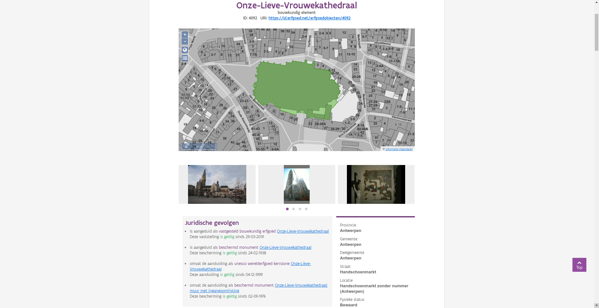

.. post:: 2019-06-18
   :category: inventory
   :tags: inventaris, erfgoedobjecten, aanduidingsobjecten
   :author: Koen Van Daele
   :language: nl

Erfgoedobjecten en aanduidingsobjecten
======================================

Op `13 mei <https://www.onroerenderfgoed.be/nieuws/inventaris-onroerend-erfgoed-vernieuwd>`_
lanceerden we een gloednieuwe `Inventaris Onroerend Erfgoed <https://inventaris.onroerenderfgoed.be>`_.
Wie de nieuwe inventaris al gebruikt heeft, heeft vast wel gemerkt dat er
sprake is van vijf verschillende datasets: erfgoedobjecten,
aanduidingsobjecten, personen, thema's en gebeurtenissen. Hierbij vormen
erfgoed- en aanduidingsobjecten de kern van de inventarisdatabank. In dit
blog-artikel gaan we dieper in op deze twee datasets. De andere
drie datasets, personen, thema's en gebeurtenissen, spelen een ondersteunende
rol. Deze komen later aan bod
(:ref:`inventaris-themas-personen-gebeurtenissen`).

De **erfgoedobjecten** zijn het kloppend hart van de inventaris. Het zijn de
dingen die wij en jullie als ons erfgoed zien. Van iconische gebouwen, zoals de
Onze-Lieve-Vrouwekathedraal of het Gravensteen, over een landschap, zoals het
Zwin, tot een eenvoudige kapel of boom, een schip of een orgel. De focus
ligt bij een erfgoedobject niet op de juridische gevolgen, maar op de wetenschappelijke 
informatie over het object. Wat is het? Hoe groot is het? Waar ligt het? 
Hoe oud is het? Hoe ziet het er uit? Wie was betrokken bij het tot stand komen? Waar kan ik er meer
over te weten komen? Het gaat om het erfgoed an sich, het ding zoals we het
kennen en zien. In de praktijk is de afbakening van zo'n erfgoedobject vaak
inherent een beetje vaag. Als je peilt naar `het Gravensteen` zal de ene
persoon misschien enkel de burcht zelf zien, een andere zal de gracht bij de
burcht rekenen en nog een derde zal misschien het Sint-Veerleplein voor het
kasteel ook als deel van het Gravensteen zien. En zeker bij heel oude gebouwen
en sites, die in de loop der tijd aan veel veranderingen onderhevig waren,
valt er wel iets te zeggen voor de verschillende afbakeningen. In de praktijk
kiezen we voor de erfgoedobjecten steeds één afbakening, maar we zien die 
niet als een heel exacte afbakening.

In tegenstelling tot de erfgoedobjecten, zijn de **aanduidingsobjecten** het
erfgoed zoals het juridisch verankerd werd: de bescherming of de vaststelling
van een erfgoedobject. Waar de grens van een erfgoedobject misschien een beetje
vaag kan zijn, moet deze van een aanduidingsobject onbetwistbaar zijn. De afbakening 
bepaalt hier namelijk welke rechtsgevolgen er op een bepaald stuk Vlaanderen van 
toepassing zijn. De laatste decennia werd deze afbakening vooral scherp gesteld voor beschermingen.
Sinds het nieuwe Onroerenderfgoeddecreet zetten we ook heel sterk in op het
exact verankeren van vastgesteld erfgoed, door deze `af te bakenen met een
polygoon in plaats van de vroegere punten
<https://www.onroerenderfgoed.be/nieuws/update-datalagen-onroerend-erfgoed-1>`_.
De belangrijkste vragen bij een
aanduidingsobject zijn: exact hoe groot is het, om welk type aanduiding gaat
het, waarom heeft dit erfgoedwaarde en welk besluit of ander document staaft 
die beslissing? Hierbij is het niet geheel ondenkbaar dat een bepaald erfgoedobject 
meerdere keren verankerd werd onder verschillende statuten, of dat een erfgoedobject in
meerdere stappen verankerd werd in verschillende kleine beschermingen of
vaststellingen.

*De Onze-Lieve-Vrouwekathedraal, een erfgoedobject en zijn aanduidingen.*

Als we bijvoorbeeld de `Onze-Lieve-Vrouwekathedraal <https://inventaris.onroerenderfgoed.be/erfgoedobjecten/4092>`_
bekijken, dan zien we dat dit erfgoedobject 4 aanduidingen bevat. Een vaststelling als
bouwkundig erfgoed, een aanduiding als Unesco werelderfgoed, een bescherming als
monument en nog een bijkomende bescherming als monument van een stukje muur.
Waar het erfgoedobject `de kathedraal` voorstelt, vertellen de
aanduidingsobjecten ons in detail wat er kan met verschillende
stukjes van de kathedraal.

Kon het niet eenvoudiger?
-------------------------

Het onderscheid tussen erfgoedobjecten en aanduidingsobjecten lijkt op het
eerste gezicht misschien wat complex en arbitrair. Dit onderscheid werd in het
leven geroepen toen we aan het project van de beschermingsdatabank werkten. Dit
was vlak na de samensmelting van het agentschap `Ruimte en Erfgoed` en het
`Vlaams Instituut voor het Onroerend Erfgoed`. De eerste beheerde de
beschermingsdatabank, de tweede de inventarisdatabank. Die laatste databank
bestond op dat moment uit een aantal inventarissen, zoals de inventaris bouwkundig erfgoed 
en de inventarissen van tuinen en parken en houtige beplantingen met 
erfgoedwaarde. Voor elk element werd een aparte pagina of fiche voorzien waarop
de belangrijkste gegevens van het object konden afgelezen worden. Op dat 
moment werd enkel het bouwkundig erfgoed vastgesteld. Alhoewel daar
achterliggend een complexere datastructuur achter zat, werd dit op een
inventarisfiche gevisualiseerd door een simpele `ja/nee` bij het veld
vastgesteld.

De beschermingsdatabank bood op dat moment veel minder
mogelijkheden dan de inventarisdatabank, dus besloten we om al het
beschermde erfgoed toe te voegen aan de inventarisdatabank en meteen te
voorzien van afbeeldingen, thesaurustermen en uitgebreide beschrijvingen.
Uiteindelijk wouden we voor het beschermde erfgoed over evenveel informatie
kunnen beschikken als we tot dan hadden voor het geïnventariseerde.

In dit eerste datamodel werd beschermd erfgoed identiek beschreven als geïnventariseerd
erfgoed. Zo was er een fiche voor een kerk in de inventaris bouwkundig erfgoed,
een fiche voor diezelfde kerk als beschermd monument en mogelijk nog een fiche
voor diezelfde kerk als onderdeel van het dorpsgezicht waarin ze stond. Die
fiches herhaalden op die manier heel veel informatie, want elk had ongeveer
dezelfde inhoudelijke en historische beschrijving. Soms met lichte verschillen
omdat de afbakening van de fiche afweek. Zeker in het geval van objecten die
meerdere beschermingen kenden, zoals een kerk waarvan de kerktoren eerst beschermd
werd en daarna het schip, leidde dit tot heel veel dubbele informatie. Algauw 
bleek dat dit een nachtmerrie zou worden om te onderhouden. Indien er nieuwe 
informatie aan het licht kwam omdat er bijvoorbeeld nieuwe inzichten waren over de
ontstaansgeschiedenis van een gebouw, moest dit aangepast worden in al die
verschillende fiches.

Een gelijkaardig probleem stelde zich ondertussen tussen de verschillende
inventarissen. Toen de inventarissen nog op papier gepubliceerd werden, was er
weinig interactie. De inventaris tuinen en parken publiceerde in de reeks `M&L
Cahiers <https://oar.onroerenderfgoed.be/reeks/MENC>`_ `Historische tuinen en
parken van Vlaanderen` een historische tuin waarvan het bijhorende bouwkundig 
erfgoed in de reeks `Bouwen door de Eeuwen Heen` gepubliceerd werd. Vaak werd 
een deel van informatie uit de ene reeks hernomen in de andere. In boekvorm was 
dit logisch en best wel praktisch. Online bleek dit minder evident. Dan waren er 
twee fiches, beiden over een kasteel met tuin, maar telkens met een andere focus, 
het kasteel of de tuin. In het beste geval waren de fiches gewoon complementair,
maar wanneer er redelijk wat tijd zat tussen de twee inventarissen, spraken ze
elkaar soms gewoon tegen. Ook hier stelde zich de vraag wat er moest gebeuren
met informatie die verouderd was en moest aangepast worden. (:ref:`On data-driven systems
and system-driven data <vdmemo2016>`)

Uiteindelijk gooiden we het roer om. We kwamen tot de conclusie dat het
essentieel was om twee zaken te scheiden. Enerzijds, de inhoudelijke
informatie. We willen die op zo weinig mogelijk plaatsen tegelijk bijhouden.
Daarom kennen we nu aan elk erfgoedobject één of meerdere disciplines toe:
archeologisch, bouwkundig, landschappelijk of varend. Waar we in het verleden
voor een kasteel met tuin vaak meerdere fiches zouden aangemaakt hebben,
streven we er nu zo veel mogelijk naar om alle informatie in één fiche samen te
brengen. De afbakening van zo'n inhoudelijk object wordt vrij gekozen op basis
van inhoudelijke afwegingen. Het is niet omdat van een bepaalde kerk enkel de kerktoren
beschermd is, dat er geen relevante inhoudelijk informatie over de volledige
kerk is. Anderzijds willen we de juridische informatie over zo'n object
los kunnen behandelen van de inhoudelijke. We willen kunnen aangeven dat een bepaalde bescherming
misschien niet meer bestaat (bv. in het geval van opheffing of vernietiging 
van het besluit), maar dat het erfgoed daarom nog niet verdwenen is. Of dat een
bepaalde bescherming slechts een deel van een erfgoedobject betreft. De
afbakening van een erfgoedobject wordt immers vrij gekozen op basis van
inhoudelijke afwegingen, in tegenstelling tot een aanduidingsobject dat ook
rekening houdt met juridische en andere technische afwegingen. Het is niet
omdat van een bepaalde kerk enkel de kerktoren beschermd is, dat we geen
informatie hebben over de rest van de kerk. Zo herwerkten we de
beschermingsdatabank tot een databank van aanduidingsobjecten. De
term aanduiding haalden we bij `Historic England
<https://historicengland.org.uk/>`_, waar men van `designation`
of `aanduiding` spreekt als het formeel toekennen van rechtsgevolgen aan
erfgoed (`MIDAS Heritage
<https://historicengland.org.uk/images-books/publications/midas-heritage>`_,
pp. 65).

Alles is verbonden
------------------

Ons erfgoed is groot en verscheiden. Elke fiche die we opnemen in onze
informatiesystemen, neemt een klein stukje van de werkelijkheid en zet dat in
de schijnwerper. Maar elk van die stukjes is verbonden met andere stukjes.
Daarom leggen we al een tiental jaar relaties tussen objecten die met elkaar
verbonden zijn. Een relatie drukt een verband uit tussen twee objecten en werkt
steeds in twee richtingen, als een woning deel uitmaakt van een sociale
woonwijk, dan omvat die sociale woonwijk ook die woning.

Waar erfgoed lange tijd beheerd werd als eerder puntsgewijze objecten, is er al
jaren een beweging aan de gang waarin grotere gehelen en contexten even
belangrijk zijn als de kleine elementen die we als evident erfgoed erkennen. In
vorige versies van de inventaris kon je deze gehelen vinden als `bouwkundige
gehelen`, `archeologische zones` en `ankerplaatsen`. Vandaag de dag zijn al
deze oude deelinventarissen erfgoedobjecten geworden. Maar we maken wel
consequent het onderscheid tussen `gehelen` (grote oppervlaktes), en
`elementen` (relatief kleinschalige stukjes erfgoed). Al sinds
2009 koppelen we verschillende erfgoedobjecten aan elkaar met een aantal
relaties:

* *is gerelateerd aan*: Een erfgoedobject is gerelateerd aan een ander
  erfgoedobject. Er is een verband tussen de beide objecten, zonder dat de ene de
  ander omvat. Dit kan een relatie zijn tussen een kolenmijn en een
  mijnwerkerscité, of een abdij en een nabijgelegen hoeve die ooit eigendom was
  van de abdij.
* *omvat*: Een erfgoedobject omvat een ander erfgoedobject. Dit kan zijn omdat
  een geheel een element omvat, bijvoorbeeld een kasteeldomein dat 
  het koetshuis of de kasteeltuin omvat. Of een element dat een ander element
  omvat, bijvoorbeeld een kerk die een apart beschreven orgel heeft.
* *is deel van*: Een erfgoedobject is deel van een ander erfgoedobject. Dit is
  het omgekeerde van `omvat`, het is dan ook logisch dat het bovengenoemde
  orgel deel is van de kerk en dat het koetshuis deel is van het kasteeldomein.

Zoals reeds vermeld hadden we in onze oude inventarissen soms meerdere fiches
die over ongeveer hetzelfde object gingen. Zoals een pastorie die apart
beschreven werd van de bijhorende tuin. In de nieuwe inventaris is het mogelijk
één fiche voor het geheel te voorzien, zodat die beschrijvingen samengevoegd
kunnen worden tot een coherente omschrijving die de beide
aspecten bevat. Aan de andere kant zal het flink wat tijd vragen voor alle
oudere fiches herwerkt zijn, dus de beide verschijningsvormen zullen momenteel
naast elkaar bestaan.

Omdat we zo duidelijk mogelijk wouden kunnen aangeven hoe erfgoedobjecten en
aanduidingsobjecten zich met elkaar verhouden, namen we de interactie tussen 
erfgoedobjecten en aanduidingsobjecten onder de loep. We kwamen tot drie 
mogelijke relaties:

* *is aangeduid als*: Een erfgoedobject is aangeduid als een 
  aanduidingsobject. Dit houdt in dat het erfgoedobject en het
  aanduidingsobject (quasi) identiek zijn qua afbakening. Het erfgoedobject is
  dus (ongeveer) in zijn geheel beschermd of vastgesteld.
* *omvat de aanduiding als*: Een deel van een erfgoedobject is
  aangeduid als een aanduidingsobject. Dit houdt dus in dat het
  erfgoedobject *groter* is dan het aanduidingsobject. Dit kan een kerk zijn
  waarvan de toren of het orgel apart beschermd werden of een historische tuin
  waarin een aantal beschermde bomen staan. Het erfgoedobject is dus
  gedeeltelijk beschermd of vastgesteld.
* *is deel van de aanduiding als*: Een erfgoedobject is deel van een
  aanduidingsobject. Dit kan bv. een boom zijn in een beschermd landschap. De
  boom is individueel beschreven als erfgoedobject, maar kent geen eigen
  bescherming. Wel is ze een onderdeel van de bescherming van het landschap.
  Het erfgoedobject is dus kleiner dan het aanduidingsobject.

Help, ik zoek iets!
-------------------

Je vraagt je misschien af wanneer je welke dataset moet gebruiken? Je kunt namelijk
`zoeken naar erfgoedobjecten
<http://inventaris.onroerenderfgoed.be/erfgoedobjecten/zoeken>`_ of `zoeken
naar aanduidingsobjecten
<https://inventaris.onroerenderfgoed.be/aanduidingsobjecten>`_. Beide
zoekformulieren bieden een aantal zoekopties of filters die te maken hebben
met rechtsgevolgen, dus wanneer gebruik je nu wat? Essentieel dien je voor ogen
te houden wat je eigenlijk aan het zoeken bent. Bij de erfgoedobjecten zoek je
naar stukjes erfgoed en zoek je primair op inhoudelijk kenmerken. De eenheid
van informatie is erfgoed. Bij de
aanduidingsobjecten zoek je naar beschermingen of vaststellingen en zoek je
primair op de kenmerken die iets over de aanduiding zeggen. De eenheid van
informatie is hier niet erfgoed, maar juridische beslissingen over erfgoed.

Stel dat we op zoek gaan naar `beschermde bibliotheken`? Als we in het
zoekformulier voor erfgoedobjecten zoeken naar `typologie=bibliotheken` en
`rechtsgevolgen=beschermd`, dan krijgen we `17 erfgoedobjecten
<https://inventaris.onroerenderfgoed.be/erfgoedobjecten?typologie=bibliotheken&rechtsgevolgen=beschermd>`_. 
In het formulier van de aanduidingsobjecten kunnen we dezelfde vraag stellen
door te zoeken op `typologie=bibliotheken`, `categorie=beschermd` (en dus de
andere categorieën uit te zetten) en `geldig=ja` (want we willen de huidige
toestand zien). Dit levert `22 aanduidingsobjecten
<https://inventaris.onroerenderfgoed.be/aanduidingsobjecten?typologie=bibliotheken&categorie=beschermingen&geldig=true>`_
op. Niet geheel hetzelfde dus. In het eerste geval hebben we 17 erfgoedobjecten
die geheel of gedeeltelijke een bibliotheek zijn (of geweest zijn), waarop een
bescherming rust. In het tweede geval hebben we 22 beschermde
objecten die iets met een bibliotheek te maken. Zo heb je bijvoorbeeld het
`Kasteeldomein van Loppem
<https://inventaris.onroerenderfgoed.be/erfgoedobjecten/209986>`_, dat 2 keer
beschermd is: het volledige domein als landschap, en het landhuis en de
bijgebouwen als monument. Naargelang wat je zoekt, zal de ene zoekopdracht
beter aansluiten bij je wensen dan de andere. 

Ik denk dat het voor iedereen die onze databanken regelmatig raadpleegt geen
geheim is dat we over rijke, maar soms ook wel heel complexe informatie
beschikken. Door deze op te delen in erfgoedobjecten en aanduidingsobjecten
kunnen we maximaal flexibel omgaan met de inhoudelijke informatie en
aanvullingen daarop doen zonder te raken aan de wettelijke verankerde
informatie in het aanduidingsobject. De opdeling stelt ons in staat een deel
van de complexiteit, ontstaan als gevolg van decennia aan erfgoedbeleid, 
te vatten in een zo begrijpelijk mogelijke vorm die toch zo feitelijk correct
mogelijk blijft. Natuurlijk blijven we steeds alert voor
mogelijkheden om onze informatie begrijpelijker en bevattelijker te maken. Heb 
je zelf nog suggesties, neem dan `contact op met ons <ict@onroerenderfgoed.be>`_.
