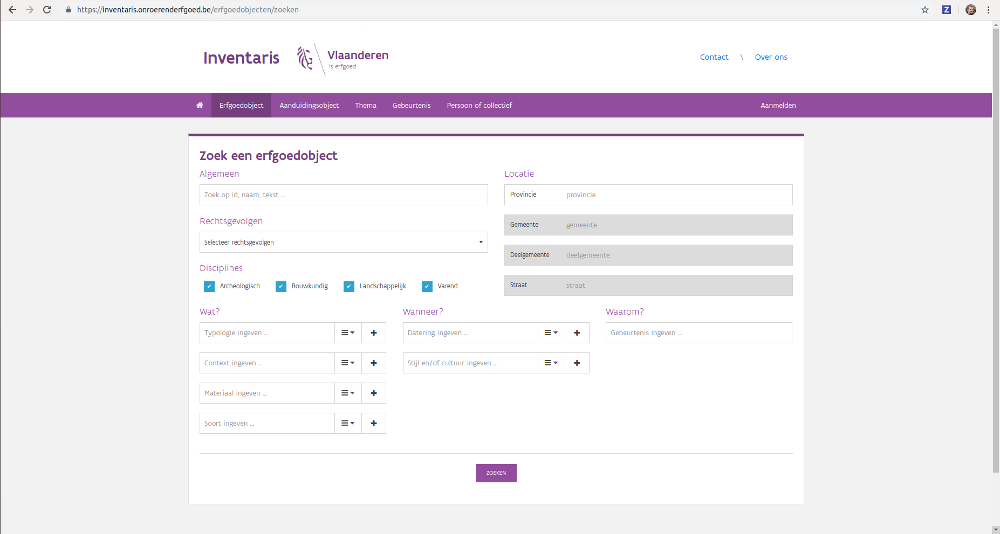

.. post:: 2019-05-15
   :category: services, inventory
   :tags: inventaris
   :author: Koen Van Daele
   :language: nl

Van zoeken naar vinden op de nieuwe inventaris
==============================================

Sinds `13 mei <https://www.onroerenderfgoed.be/nieuws/inventaris-onroerend-erfgoed-vernieuwd>`_
staat er een gloednieuwe inventaris op https://inventaris.onroerenderfgoed.be.
Zoals altijd is het even aanpassen. En dat is misschien het duidelijkste
in de zoekmogelijkheden. Sommige mogelijkheden zijn blijven bestaan, 
andere zijn lichtjes of sterk gewijzigd. Omdat het even wennen is, lijsten we
op onze IT blog de voornaamste mogelijkheden qua zoeken op. Vandaag geven we
een aantal algemene principes mee, die we later verder uitdiepen. 

.. warning::
   Omdat de nieuwe inventaris nog vers is, kunnen er nog lichte 
   verschuivingen optreden, dus mogelijk is nog niet alles definitief.

De inventaris bevat op dit moment 5 grote datasets: erfgoedobjecten,
aanduidingsobjecten, personen, themas en gebeurtenissen. Veel zoekmogelijkheden
en principes worden gedeeld tussen de verschillende datasets. We hebben
geprobeerd bepaald regels en patronen voorspelbaar te maken en maximaal 
te hergebruiken. Zo kun je er van uit gaan dat het zoeken erfgoedobjecten of
aanduidingsobjecten in een bepaalde gemeente hetzelfde verloopt. Of dat het
zoeken met thesaurustermen overal op dezelfde manier werkt.

User Interface vs. REST service
-------------------------------

Bij het zoeken maken we een onderscheid tussen de een zoekservice en de UI
(User Interface) die kan gebruikt worden. Zoeken is een zeer complexe materie
waarin we soms willen kunnen gebruik maken van meerdere parameters, booleaanse 
combinaties (dit EN dat, dit OF dat, NIET dit), zoeken met een id of een string, 
wildcards, ... En dit moet allemaal simpel en eenduidig zijn. In de praktijk 
merken we dat de perfecte UI voor zoekacties niet bestaat en altijd afhankelijk
is van de gebruiker die aan het zoeken is. Iets wat heel vaak moeilijk te voorspellen
valt. Daarom hebben de toepassingen van het agentschap dikwijls zoekservices 
die meer aankunnen dan wat de UI ontsluit. De standaard UI bouwen we voor een 
doorsnee gebruiker, de service zelf richt zich meer op ontwikkelaars en ervaren
gebruikers die wat vlotter met IT tools overweg kunnen.

Onder de UI verstaan we de verschillende zoekformulieren, zoals
https://inventaris.onroerenderfgoed.be/erfgoedobjecten/zoeken. Hier kun je op
een relatief simpele en sterk begeleide manier je zoekparameters ingeven. We
geven je voorbeeldlijstjes met gemeente- en straatnamen zodat je die niet van
buiten hoeft te kennen. Het nadeel van een UI is dat deze duur is om te
ontwikkelen. Het is dan ook verre van
evident om complexe zoekopdrachten in zo'n formulier te verwerken. 

*Via de User Interface kan je vlot simpele zoekopdrachten ingeven*

De service is een door machines bevraagbare dienst waaraan we vragen kunnen
stellen. De UI doet eigenlijk niet meer dan een gebruiker helpen bij het
opstellen van queries voor deze service. Onze services zijn zogenaamde `REST`
services die `JSON` gebruiken om informatie door te sturen. Zonder in veel
details te gaan willen we meegeven dat je het resultaat van een zoekactie in de
nieuwe inventaris zowel
kan doorbladeren als `HTML`, en kan downloaden als `JSON` of `CSV` gegevens.
Dit kan je heel eenvoudig doen door een zoekactie uit te voeren via het
formulier en de daaruit verkregen URL te bevragen met een andere HTTP Accept
header, `application/json`.

Dit kan je doen met een command-line tool zoals :command:`curl`, maar ook met een
zogenaamde `REST` client of met je favoriete programmeertaal.

.. code::
   
   $ curl -X GET -H "Accept: application/json" https://inventaris.onroerenderfgoed.be/erfgoedobjecten?gemeente=278

Full text zoeken vs. filteren
-----------------------------

De zoekformulieren van de inventaris ondersteunen zowel een vorm van
full-text zoeken (soms ook kortweg zoeken genoemd) als een vorm filteren. Dat
klinkt misschien heel gelijkaardig, maar eigenlijk dienen beiden een heel
verschillend doel. Beide technieken dienen om gericht informatie te vinden in
een grote set van gegevens. Ze zorgen er dus voor dat we niet relevante
gegevens niet hoeven te zien. In beiden gevallen krijg je bij ons nog steeds
pagina's met gegevens te zien. Dus waar zit dan het verschil?

Filteren is bij uitstek een zwart/wit of ja/nee verhaal. Een object beantwoordt
aan een filtercriterium of niet. Je wenst bv. al het erfgoed in een bepaalde
gemeente of straat te kennen. Of alle kerken. Of alle kerken in een bepaalde
gemeente. Hierbij ben je meestal niet op zoek naar 1 enkel object. Soms wil je
enkel weten hoeveel woningen er in een gemeente zijn en wil je ze zelfs niet
individueel zien.

Full-text zoeken is geen zwart/wit verhaal, maar grijs. De zoekmachine probeert
het meest relevante resultaat voor je vraag te geven. Je zoek bv. naar
efgoedobjecten waarin `Gravensteen` voorkomt of `Sint-Veerle`. Hier ben je
meestal maar op zoek naar een kleine aantal objecten of wil je iets meer weten
over `Sint-Veerle`. Kenmkerkend hierbij is dat we de zoekresultaten zo proberen
te ordenen dat het meest relevante object bovenaan de lijst staat. Hoe verder
je door de lijst bladert, hoe minder kans dat een resultaat echt relevant is
voor je. Dit is dezelfde manier waarop de grote zoekmachines op het internet
zoals *Google* werken.

Natuurlijk kun je beiden technieken ook combineren. Stel dat je full-text naar het
`Gravensteen` zoekt, dan zie je dit:
https://inventaris.onroerenderfgoed.be/erfgoedobjecten?tekst=gravensteen . Tien
objecten waarvan het eerste het Gravensteen in Gent is. Het laatste object is
echter de archeologische zone van Aalst, omdat in de beschrijving daarvan ook
`gravensteen` voorkomt. Stel dat we enkel interesse hebben in het Gentse
gravensteen, dan kunnen we onze zoekresultaten filteren op de gemeente Gent
met: https://inventaris.onroerenderfgoed.be/erfgoedobjecten?tekst=gravensteen&gemeente=278 . 
Ook deze keer staat het Gravensteen in Gent bovenaan de lijst, maar er zijn
slechts 7 resultaten aangezien fiches die niet in de gemeente Gent liggen uit
de lijst geweerd zijn.

Bedenk dat zolang je een full-text zoekactie doet door de parameter `Algemeen`
in te vullen in een zoekformulier, de toepassing zal sorteren op relevantie.
Als je niet full-text zoekt, wordt er op locatie gesorteerd. Indien je
full-text zoekt kan je de sorteervolgorde nog altijd aanpassen. Dit is echter
maar zelden aangewezen. Je zou bv. alle fiches van erfgoedobjecten in Gent
kunnen zoeken waarbij het `Gravensteen` in de fiche voorkomt en dit op locatie
laten sorteren omdat je niet geïnteresseerd bent in de meest `Gravenstenige`
fiche, maar gewoon alles waarin melding van het `Gravensteen` wordt gemaakt.

Hopelijk heb je nu al iets meer inzicht in de werking van de inventaris
zoekmachines en snap je wanneer je best kunt zoeken of filteren. Of wanneer je
de combinatie kunt toepassen. In een volgende blog leggen we uit hoe je
gerichter kunt full-text zoeken en hoe we nu eigenlijk bepalen wat de meest
relevante fiche is voor een bepaalde vraag. Op basis van wat beslissen we nu 
wat het meest `Gravenstenige` erfgoedobject is?
