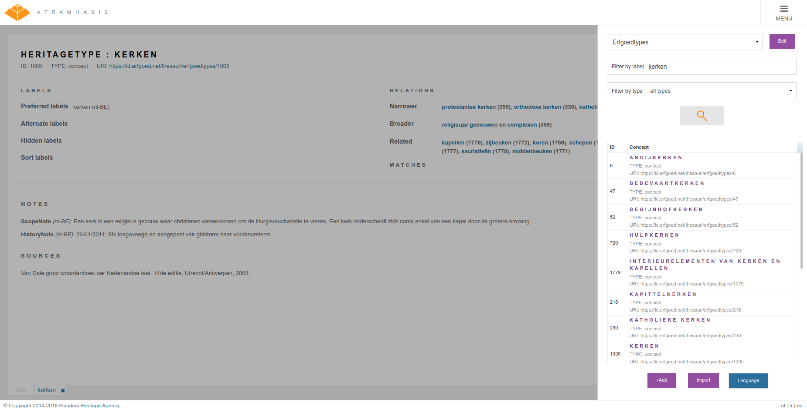

.. post:: 2020-11-06
   :category: releases, thesaurus, open source
   :tags: atramhasis
   :author: Koen Van Daele
   :language: en

Atramhasis v0.7.0 released
==========================

A new version (0.7.0) of `Atramhasis <https://pypi.org/project/atramhasis/>`_ has been released.
Atramhasis is an open-source, web-based SKOS editor. You can use it to browse
SKOS vocabularies, thesauri, authority files, word lists, ... Atramhasis 
comes with an admin interface you can use to add the concepts and collections of
your vocabularies. To make integrating vocabularies with your other IT systems
easy, all data in Atramhasis is exposed through a read an write REST webservice.

This version does not contain a lot of features visible to end users. Most
improvements are technical in nature, improving stability of the application.
One new feature is the addition of `a simple tree <https://thesaurus.onroerenderfgoed.be/conceptschemes/SOORTEN/tree>`_ 
that makes printing a thesaurus feasible.

.. warning::

    This releases does contain some backwards incompatible changes that require a careful 
    upgrade and some manual intervention. **The 0.7.x releases will also be the 
    last to support Python 2.** If you haven’t upgraded to Python 3 yet, we advise 
    you to do now.

The backwards compatibility breaking change in this version 
has to do with how and when the `skosprovider.registry.Registry` is instantiated. 
While this used to be done when the application starts, it is now done when 
a request is created. The previous way of working created problems with SQLAlchemy 
providers in a webserver using mutiple threads. Please review the docs at 
https://atramhasis.readthedocs.io/en/latest/customisation.html#creating-conceptschemes 
to see how it works now. For more background, have a look at the pyramid_skosprovider 
docs at https://pyramid-skosprovider.readthedocs.io/en/0.9.0/install.html

We changed the implementation SKOS collections. The default assumption has
always been that concepts in a collection were also narrower concepts of the 
collection’s superordinate concept, but the implementation for this was 
incomplete and contained bugs. This has been changed by adding a boolean attribute 
infer_concept_relations to collections. When set to true, concepts in a 
collection are considerd to be narrower concepts of that collections’s 
superordinate concept. When set to False, they are not considered as narrower 
concepts. This is especially important for a provider’s expand function and 
affects what is considered a narrower concept of a concept that uses 
`thesaurus arrays` or `node labels`.

We also put some more thought into SEO. HTML concept detail pages were expanded with some
HTML metadata such as a canonical URL, a Twitter card and OpenGraph info. We
also included a script that can generate an XML sitemap for you installation.
This allows search engines to index your thesaurus site more efficiently.

*A view of the Atramhasis admin interface*

For those of you who are unsure about what Atramhasis looks like and does,
we've added a `section to the documentation <https://atramhasis.readthedocs.io/en/latest/features.html>`_ 
that explains the purpose of the application and how the interface functions.

As always, lots of bugs were fixed, code was refactored and 
rewritten and documenation has been updated. See
https://github.com/OnroerendErfgoed/atramhasis/releases/tag/0.7.0 for the full
list of changes.

We invite everybody to try out the release. You can see a working example of
Atramhasis at https://thesaurus.onroerenderfgoed.be, a customised version of
Atramhasis containing the thesauri use by `Flanders Heritage Agency <https://www.onroerenderfgoed.be>`_.
If you encounter problems, please let us know. Either through the 
`forum <https://groups.google.com/forum/#!forum/atramhasis>`_ or our 
`Github tracker <https://github.com/OnroerendErfgoed/atramhasis>`_.
